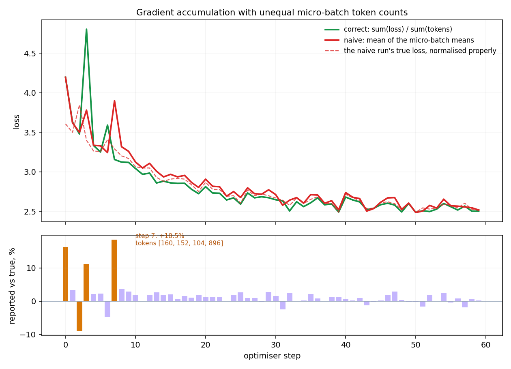
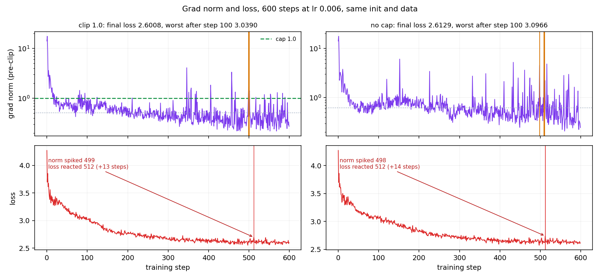

# Session 10 — The Training Loop

The assignment, on nanoGPT. Take a small model and a real loop, and make it tell you the truth
about itself.

**Model:** [karpathy/nanoGPT](https://github.com/karpathy/nanoGPT) at the `shakespeare_char` size —
6 layers, 6 heads, `d_model` 384, `block_size` 256, vocab 65, **10.75M parameters**, dropout 0.
**Hardware:** one NVIDIA GeForce GTX 1650 Ti, 3.63 GiB, 16 SMs, compute capability 7.5, fp32.

```bash
cd assignment
python assignment.py all         # clones nanoGPT, prepares the data, runs all six parts
python assignment.py selfcheck   # the asserts only, no GPU needed
python plots.py                  # the two figures below
```

`assignment.py` does not fork nanoGPT's trainer. It imports its `GPT` and drives it from an
instrumented loop, which is what parts 3 to 5 need anyway. Every number below comes from
`assignment/results.json`.

---

## 1. Every tensor shape in the step

B = 4, T = 256, D = 384, V = 65.

| Tensor | Shape | What each dimension is |
| ------ | ----- | ---------------------- |
| tokens `x` | (4, 256) | B = sequences in the batch, T = positions in each |
| targets `y` | (4, 256) | same grid, each entry the token one position later |
| `tok_emb` | (4, 256, 384) | B, T, D = channels per token |
| logits | (4, 256, 65) | B, T, V = one score per vocabulary token |
| logits, flattened | (1024, 65) | every position becomes an independent example |
| targets, flattened | (1024,) | one correct token id per example |
| loss | () | scalar: the mean over contributing positions |
| `lm_head.weight` | (65, 384) | V, D = one learned row per token |

The flattening is the step people skip. B and T stop being separate the moment the loss is taken:
1,024 positions become 1,024 independent classification problems, and the loss is their mean. That
is why §8's "divide by what" question has a wrong answer available at all.

## 2. One gradient, verified by hand

Weight: `transformer.h[0].mlp.c_fc.weight[0,0]`, on a 2-layer 0.10M-parameter model, **float64 on
CPU**, dropout 0, one fixed batch. h = 1e-4.

| | Value |
| --- | --- |
| loss at w | 4.128666675461 |
| loss at w + h | 4.128666691085 |
| **analytic**, from `backward()` | **0.000156522943** |
| forward difference, `(L(w+h) − L(w)) / h` | 0.000156240860 — rel err **1.8e-03** |
| central difference, `(L(w+h) − L(w−h)) / 2h` | 0.000156522972 — rel err **1.9e-07** |

Agreement to **seven significant figures** on the central difference. The forward difference — the
shape the lesson uses for its 0.064 / 0.001 = 64 — is three orders of magnitude worse, because its
error is O(h) where the central difference's is O(h²). The lesson's version is right for showing
what a gradient *is*; it is not the one to check an implementation with.

This check has to run in float64. bf16 carries 2.4 decimal digits, so "agree to several decimals"
is not a bar it can clear — §10's trade, arriving from the other side.

## 3. Gradient accumulation, broken on purpose

nanoGPT `train.py:301` is `loss = loss / gradient_accumulation_steps` — the average of the
averages. It is correct in nanoGPT as shipped, because fixed `block_size` chunks give every
micro-batch exactly B·T valid tokens.

**So the first job was to make the bug possible.** Masking a per-micro-batch tail with
`ignore_index=-1` (which `model.py:187` already honours) gives genuinely unequal token counts.
Drawing the length per micro-batch, not per row, matters: rows averaged inside one micro-batch wash
the difference out, and it is the spread *between* micro-batches the naive normaliser gets wrong.

The lesson's static case reproduces exactly:

| | Value |
| --- | --- |
| correct, `Σ nᵢLᵢ / Σ nᵢ` | 2.6000 |
| naive, `ΣLᵢ / 3` | 3.0000 |
| **gap** | **15.4%** |
| the same three losses at equal token counts | **0.0%** ← how it hid |

And on the real loop, 60 steps, 4 ragged micro-batches each:



| | Value |
| --- | --- |
| worst step (step 7, token counts [160, 152, 104, 896]) | reported **3.8988** against a true **3.2896** — **+18.5%** |
| mean absolute gap over the run | 2.25% |
| final loss, correct vs naive | 2.5025 vs 2.5175 |

**The loss curves are the least of it.** Two runs from one identical initialisation, one
accumulation step each:

| Gradient, naive against correct | |
| --- | --- |
| cosine similarity | 0.9725 |
| ‖naive‖ / ‖correct‖ | 1.0735 |
| relative difference | **0.2539** |

A gradient **25% wrong**, pointing 13° off, on the very first step. The loss curves sit almost on
top of each other — the dashed line in the figure is the naive run's own loss re-normalised
properly, and the gap between it and the red line is the entire visible symptom. This is the
lesson's point stated as a measurement: the curve looks fine while the update does not.

## 4. Grad norm, logged every step

`clip_grad_norm_` returns the norm **before** clipping. `train.py:309` calls it and discards the
return value. Logging it costs one variable.

600 steps at lr 6e-3 (nanoGPT's `shakespeare_char` default is 1e-3; the higher rate is there to
produce real spikes rather than a manufactured one), clip 1.0, run both ways from an identical
initialisation and data order.



| | clip 1.0 | no cap |
| --- | --- | --- |
| median norm | 0.5095 | 0.6231 |
| max norm | 17.57 | 17.65 |
| final loss | 2.6008 | 2.6129 |
| worst loss after step 100 | 3.0390 | 3.0966 |
| spikes that led the loss | 2 | 3 |

52 of 600 steps were clipped.

**The step asked for**, and both runs show it. Uncapped: the norm rose to **4.530 at step 498**,
8.5× its own trailing median; the loss did not move there, and cleared 2σ of its own step-to-step
noise at **step 512** — **14 steps later**. Capped: the same warning at step **499**, the same
reaction at **512**, a 13-step lead. Mean lead across the uncapped run's three spikes: 6.0 steps.

Two honesty notes on this part.

A first attempt counted *any* upward move in the loss as a reaction and found "leads" whose loss
rise was 0.0006 — noise dressed as a finding. Requiring the rise to clear 2σ of the run's own noise
is what makes the number mean anything, and it dropped the count from 10 to 2.

And these runs are **not bit-reproducible** despite fixed seeds: cuBLAS reductions are
non-deterministic, and over 600 steps that compounds. Across reruns the uncapped run gave 0 and
then 3 leading spikes. The qualitative finding — the norm moves first, by roughly 5 to 15 steps —
survives; the exact step numbers do not. Anyone rerunning this will get different indices.

## 5. MFU, computed honestly

10.75M parameters, B = 16, T = 256, fp32. **204.5 ms/step, 20,034 tokens/s.**

| Quantity | Value |
| --- | --- |
| 6N per token | 64.5 MFLOP |
| achieved, 6N × tokens/s | **1.2916 TFLOP/s** |
| theoretical fp32 peak: 16 SM × 64 lanes × 2 × 2,100 MHz | 4.30 TFLOP/s |
| **MFU = achieved / theoretical peak** | **30.0%** |
| measured 4096³ matmul ceiling, fp32 | 1.47 TFLOP/s |
| fraction of that ceiling | **87.6%** |
| nanoGPT's own `estimate_mfu` | 0.46% |

Three notes, because the denominators disagree by two orders of magnitude and only one of them is
about this machine.

**nanoGPT's 0.46% is not this card's number.** `model.py:301` hardcodes `flops_promised = 312e12`,
an A100's bf16 peak. On a 1650 Ti that denominator is 73× too large. Its numerator differs too:
`6N + 12·L·H·Q·T` = 71.5 MFLOP per token, 1.11× the lesson's plain 6N, because it counts the
attention matmuls the 6N rule folds away. Neither is wrong; they answer different questions.

**The theoretical peak is derived, not quoted.** 16 SMs × 64 FP32 lanes × 2 flops per FMA × the
2,100 MHz `nvidia-smi` reports as max SM clock. No datasheet figure this run cannot verify.

**What costs me the distance to 40%.** Nothing in my loop, and this is the uncomfortable part. A
plain 4096³ fp32 matmul on this box reaches **1.47 TFLOP/s — only 34% of the 4.30 theoretical
peak**. cuBLAS cannot get closer than that here, so 34% is the practical ceiling for *any* fp32
workload on this card, and 40% MFU is not reachable at all. Against what is reachable I am at
**87.6%**, which is the honest reading: the training loop is not the problem. The three things that
would actually move it are all hardware-shaped — bf16 or fp16 tensor-core paths (this device
measured fp16 matmul at **0.38 TFLOP/s, slower than fp32**, so that road is closed too), a card
whose matmul reaches nearer its own peak, and a larger model to amortise the per-step Python and
launch overhead across more arithmetic.

That last point is the lesson's §14 in miniature: at 10.75M parameters on 3.63 GiB the loss curve
would look identical at any of these numbers. Nothing in it mentions the ceiling.

## 6. 0.1 in fp32, bf16 and fp8 E4M3

Encoded by hand — sign, biased exponent, mantissa as a binary fraction, round-half-to-even,
subnormals handled — then cross-checked against `struct` and against torch's own `bfloat16` and
`float8_e4m3fn` casts. All three match exactly.

| Format | s | exponent | mantissa | reads back as | error |
| ------ | - | -------- | -------- | ------------- | ----- |
| fp32 | 0 | 01111011 | 10011001100110011001101 | 0.10000000149011612 | 0.0000% |
| bf16 | 0 | 01111011 | 1001101 | 0.10009765625 | 0.0977% |
| fp8 E4M3 | 0 | 0011 | 101 | 0.1015625 | 1.5625% |

fp32 bits `0x3dcccccd`, confirmed against `struct.pack`.

All three carry the **same exponent**, −4: 0.1 = (1 + f) × 2⁻⁴. Only the mantissa is cut, 23 bits
to 7 to 3. That is §9's trade with nothing else moving — 0.1 is nowhere near any format's range
limit, so range buys nothing here and every bit lost is precision lost. The failure mode fp16 has
at 10⁻⁸ never appears at 0.1, which is exactly why 0.1 is the wrong number to pick a format with.

**Which would I train in?** bf16, and not because of this row. On its own the table argues for
fp32: 0.0977% error against 0.0000%. The row that decides it is the one this value cannot show —
bf16 keeps all eight of fp32's exponent bits and reaches down to 9.18e-41, so late-run gradients
near 10⁻⁸ survive with no loss-scaling apparatus, while fp16, more precise here, flushes them to
zero and needs a scale factor to be tuned and eventually gotten wrong. Half the memory and half the
bandwidth for 2.4 decimal digits is the trade, and the 25%-wrong gradient in part 3 is a reminder
that 2.4 digits is not what breaks a run.

Not on this hardware, though: compute capability 7.5 has no bf16 tensor-core path, and the measured
fp16 matmul here is slower than fp32. Every number above was produced in fp32 for that reason.

---

## What the six parts add up to

Four of the six numbers here would have looked perfectly healthy if I had not gone looking. The
naive accumulation gave a 25%-wrong gradient under a loss curve that tracks the correct one. The
grad norm carried a 14-step warning that nothing in the loss showed. The MFU that `estimate_mfu`
reports for this box is off by 73× in the denominator alone. And the format table talks you into
fp32 unless you already know which column matters.

> Print things and check things. Every serious training bug is silent, and the loss curve is not
> going to be the one that tells you.

## Files

```
assignment/
  assignment.py            six parts, plus `selfcheck` — asserts with no GPU needed
  plots.py                 the two figures
  results.json             every number above, as produced
  part3_accumulation.png
  part4_gradnorm.png
  nanoGPT/                 cloned on demand, gitignored
reference/                 the scraped lesson, widgets and mined baselines
```
