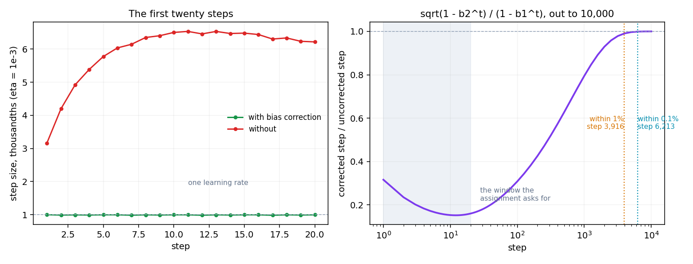
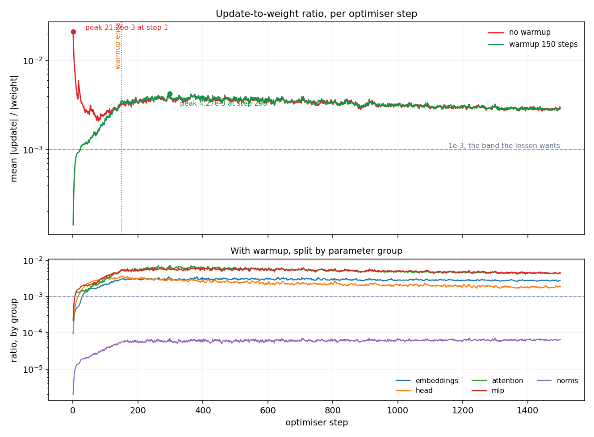
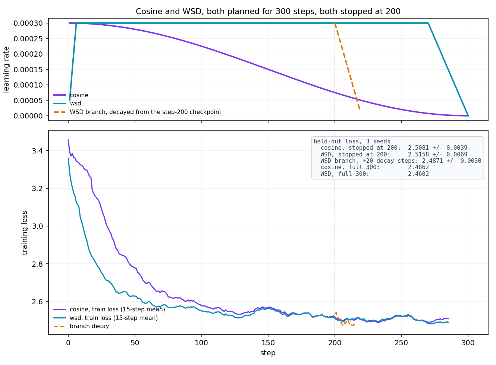
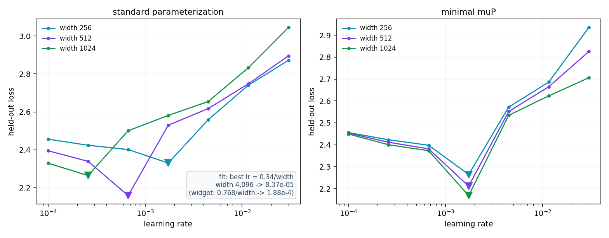

# Session 11 — Optimizers and Learning-Rate Schedules

The assignment, on nanoGPT. A gradient gives a direction; every part below is about the distance.

**Model:** [karpathy/nanoGPT](https://github.com/karpathy/nanoGPT) at the `shakespeare_char` size —
6 layers, 6 heads, `d_model` 384, `block_size` 256, vocab 65, **10.65M parameters**, dropout 0.
Part 5 uses a 4-layer model at three widths instead.
**Hardware:** one NVIDIA GeForce GTX 1650 Ti, 4 GiB, fp32, torch 2.9.1+cu128.

```bash
cd assignment
python assignment.py all         # every part, writes results.json
python assignment.py selfcheck   # the asserts only, no GPU needed
python assignment.py 5 --arm mup # one part, one arm
python assignment.py 5b          # re-run part 5's minima on two more seeds
python plots.py                  # the four figures below
```

`assignment.py` does not fork nanoGPT's trainer. It imports its `GPT` and drives it from an
instrumented loop, which parts 3 to 5 need anyway. Every number below comes from
`assignment/results.json`; the baselines they are checked against were mined out of the course
widgets into `reference/mined-numbers.md`.

---

## 1. Adam by hand

η = 1e-3, β = (0.9, 0.999), ε = 1e-8, w₀ = 1.0, and the five gradients the Section 6 widget uses.

| t | g | m | v | m̂ | v̂ | step | w |
|---|---|---|---|---|---|---|---|
| 1 | 0.50 | 0.050000 | 0.00025000 | 0.5000 | 0.250000 | −0.001000000 | 0.999000000 |
| 2 | 0.40 | 0.085000 | 0.00040975 | 0.4474 | 0.204977 | −0.000988126 | 0.998011874 |
| 3 | 0.60 | 0.136500 | 0.00076934 | 0.5037 | 0.256703 | −0.000994140 | 0.997017734 |
| 4 | 0.45 | 0.167850 | 0.00097107 | 0.4881 | 0.243132 | −0.000989847 | 0.996027887 |
| 5 | 0.55 | 0.206065 | 0.00127260 | 0.5032 | 0.255030 | −0.000996425 | 0.995031463 |

The widget's fifth-step weight is 0.995031. Ours is 0.995031463. Against `torch.optim.Adam` fed the
same gradients in float64, the worst relative disagreement over the five steps is **4.8e-14** —
fourteen decimal places, not "several".

**The two rules are not the same expression.** The lesson writes `η·m̂/(√v̂ + ε)`; PyTorch computes
`(η/(1−β₁ᵗ)) · m / (√v/√(1−β₂ᵗ) + ε)`, which puts ε *outside* the second moment's bias correction.
Written out, PyTorch's own form reproduces its output to **4.8e-17**, so the gap between the two
expressions is the ε term alone: invisible here, and it grows as √v̂ shrinks toward ε.

### The same five steps on a real weight tensor

`transformer.h.0.mlp.c_fc.weight`, real gradients, fp32 on the GPU, both rules fed the **same**
gradient tensor inside one run:

| step | max abs difference | the step being taken |
| ---- | ------------------ | -------------------- |
| 1 | 7.451e-09 | 1.000e-03 |
| 5 | 7.451e-09 | 1.008e-03 |

Constant at 7.45e-09, which is fp32 rounding on a weight of that magnitude and nothing else.

The check had to be built that way. Two *separate* runs of the identical script on this GPU end up
**3.14e-05** apart on the same tensor after one step — thirty times the step being measured, from
non-deterministic reduction order in the backward kernels. "They should agree to several decimal
places" is a statement about the update rule, and it only survives if the two rules are handed one
gradient rather than each computing their own.

## 2. Bias correction, and the twenty-step window



The ratio of the two steps has the gradients cancel out of it entirely:

    corrected step / uncorrected step = √(1 − β₂ᵗ) / (1 − β₁ᵗ)

It is a property of the two betas, not of the data — verified against the simulation to **1.9e-07**,
which is the ε term again.

| t | with correction | without | ratio |
|---|---|---|---|
| 1 | −0.00100000 | −0.00316228 | 0.3162 |
| 5 | −0.00099642 | −0.00577641 | 0.1725 |
| 10 | — | — | 0.1532 |
| 20 | −0.00099642 | −0.00621861 | 0.1602 |

**The difference does not stop mattering inside twenty steps — it gets worse.** At t = 1 the
uncorrected step is 3.16x too large, which is the number the widget shows. By t = 20 it is
**6.24x** too large, because β₁'s correction has nearly finished while β₂'s has barely started.
After twenty steps the two weights are **0.0991** apart, on a weight that started at 1.0.

Answering the question the assignment actually asks needs the rule run out further:

| criterion | step |
|---|---|
| within 1% of the corrected step | **3,916** |
| within 0.1% | **6,213** |

β₂ = 0.999 has a ~1,000-step memory, so `√(1 − β₂ᵗ)` needs thousands of steps to reach 1. Twenty
steps is two orders of magnitude short of where the answer lives.

## 3. The update-to-weight ratio, per layer



Two 1,500-step runs, identical seed and data order, AdamW at η = 3e-4, λ = 0.1 with norms and biases
excluded. One warms up over 150 steps, one does not. Every step, every parameter tensor:
`‖w_after − w_before‖ / ‖w_before‖`.

nanoGPT ties `lm_head.weight` to `wte.weight`, which makes the head and the embedding one tensor and
Section 14's head-versus-body question unaskable. This run unties them.

| | peak ratio | at step | settled (second-half median) | final train loss |
|---|---|---|---|---|
| no warmup | **21.26e-3** | 1 | 3.04e-3 | 1.8945 |
| warmup 150 | **4.27e-3** | 298 | 3.06e-3 | 1.9251 |

The widget predicts 19.2e-3 without warmup, from η/(1/√4096) = 0.0003/0.0156. We measure 21.26e-3 at
a `d_model` of 384 rather than 4,096 — the prediction is within 11% of a measurement it was not
scaled for, because the initialization scale it assumes is the one nanoGPT actually uses.

**When does warmup stop changing the ratio?** The learning rates are identical from step 150 onward,
but the ratios are not, and the honest answer is a ladder rather than a step:

| the two runs stay within | from step |
|---|---|
| 50% | 60 |
| 25% | 83 |
| 10% | **758** |
| 5% | 1,500 (the end of the run) |
| 1% | never |

They never rejoin because after step 1 they are different models. The warmup run's first hundred
steps happened at a smaller learning rate, so it is at different weights forever; the ratios converge
in distribution, not in value.

### By group, with warmup

| group | peak | at step | settled |
|---|---|---|---|
| attention | 7.210e-3 | 299 | 4.664e-3 |
| mlp | 6.277e-3 | 375 | 4.829e-3 |
| head (`lm_head`, untied) | 3.683e-3 | 149 | **1.991e-3** |
| embeddings | 3.490e-3 | 294 | 2.830e-3 |
| norms | 0.071e-3 | 1220 | 0.062e-3 |

Two things fall out of the split. The whole model sits about **3x above** the 1e-3 band the lesson
asks for, so η = 3e-4 is too large for a model of this width — the band is a diagnostic that works,
and it says our learning rate is not tuned. And the head moves at **41% of the body's rate**
(1.99e-3 against 4.66e-3 and 4.83e-3), which is Section 14's open question answered in the direction
that says a separate head learning rate is worth measuring, not assuming.

Without warmup, every group peaks at step 1 — attention and MLP at 33.4e-3, the embeddings and head
near 14.5e-3, norms at 0.30e-3. It is one step, in a direction chosen by an untrained model, and it
is the step warmup exists to prevent.

## 4. Cosine against WSD, both stopped early



Three seeds each, 300 planned steps, identical data order, held-out loss on a fixed 20-batch slice
of `val.bin`. WSD is the widget's shape: warmup over the first 2% (6 steps), flat to 90% (270), then
linear decay over the last 10%.

| | held-out loss at step 200 | at step 300 |
|---|---|---|
| cosine | **2.5081 ± 0.0039** | 2.4862 ± 0.0078 |
| WSD | **2.5158 ± 0.0069** | 2.4602 ± 0.0033 |
| WSD checkpoint at 200, decayed over 20 extra steps | **2.4871 ± 0.0030** | — |

**Stopped cold at 200, cosine wins by 0.0077 against a seed spread of 0.0069.** The gap is about one
standard deviation: real, small, and exactly the result the lesson predicts, because cosine has
already decayed to a quarter of its peak at step 200 while WSD is still flat out.

**Which model would I keep?** Neither of the two the question offers. WSD's step-200 checkpoint,
decayed over 20 more steps, reaches **2.4871** — better than cosine-stopped-at-200 by 0.021, three
seed-spreads, and within noise of cosine's full 300-step result at a tenth of the extra compute.
That is the whole argument for WSD: the flat phase means the run does not have to know its own length,
and 7% more steps buy the decay whenever you decide to stop. Cosine stopped at 200 cannot be
repaired — its schedule was defined by a total it never reached.

At the full 300 steps WSD also finishes ahead, 2.4602 against 2.4862.

## 5. Learning rate against width, and the value for 4,096



4 layers, `n_head = width/64`, B = 8, T = 256, 400 steps, 2% warmup, grad clip 1.0, seven learning
rates log-spaced from 1e-4 to 3e-2 (each cell 2.59x the last), scored on the same held-out slice.
Two arms, 42 runs, about 45 minutes on the 1650 Ti.

The muP arm scales the hidden matrices' init by `1/√(width/256)`, divides their learning rate by the
same factor, and divides the logits by it. Embeddings and norms are left alone. nanoGPT ties
`lm_head` to `wte`, so the head keeps embedding-like treatment rather than muP's untied `1/fan_in`
init — the output multiplier carries the part that matters for transfer.

### Standard parameterization

| width | 1.00e-4 | 2.59e-4 | 6.69e-4 | **1.73e-3** | 4.48e-3 | 1.16e-2 | 3.00e-2 |
|---|---|---|---|---|---|---|---|
| 256 (3.23M) | 2.4561 | 2.4239 | 2.4014 | **2.3300** | 2.5592 | 2.7407 | 2.8721 |
| 512 (12.75M) | 2.3951 | 2.3391 | **2.1585** | 2.5297 | 2.6177 | 2.7479 | 2.8955 |
| 1024 (50.67M) | 2.3293 | **2.2645** | 2.5008 | 2.5812 | 2.6550 | 2.8327 | 3.0451 |

The minimum moves left by exactly one grid cell per doubling of width: 1.73e-3, 6.69e-4, 2.59e-4.

### Minimal muP

| width | 1.00e-4 | 2.59e-4 | 6.69e-4 | **1.73e-3** | 4.48e-3 | 1.16e-2 | 3.00e-2 |
|---|---|---|---|---|---|---|---|
| 256 | 2.4558 | 2.4230 | 2.3980 | **2.2646** | 2.5720 | 2.6861 | 2.9349 |
| 512 | 2.4535 | 2.4115 | 2.3814 | **2.2114** | 2.5521 | 2.6646 | 2.8253 |
| 1024 | 2.4491 | 2.4003 | 2.3730 | **2.1683** | 2.5345 | 2.6230 | 2.7057 |

**All three widths pick 1.73e-3**, and the whole curve — not just its minimum — sits almost on top of
the width-256 curve, shifted down by the loss the extra width buys. That is the property muP is for:
the sweep at width 256 is a valid measurement for the model you cannot afford to sweep.

### Are the minima real, or one seed's luck?

Each cell above is one seed. Re-running each width's best cell and its two neighbours on two more
seeds (`python assignment.py 5b`):

| width | single-seed pick | 3-seed mean pick | worst per-cell spread |
|---|---|---|---|
| 256 | 1.73e-3 | 1.73e-3 | 0.0451 |
| 512 | 6.69e-4 | 6.69e-4 | 0.0098 |
| 1024 | 2.59e-4 | 2.59e-4 | 0.0145 |

All three picks survive. The spread is largest at width 256's optimum (±0.045) and the gap to the
neighbouring cell there is 0.13 — three spreads, so the pick holds, but it is the least safe of the
three. Everywhere else the gaps are 0.2 to 0.3 against spreads under 0.015.

### The value at width 4,096

Fitting `best η = K/width` across the three widths gives **K = 0.343**, and the log-log slope is
**−1.37** rather than the −1 the inverse-width rule predicts.

| | K | η at width 4,096 |
|---|---|---|
| widget_9's rule | 0.768 | 1.875e-4 |
| our fit | 0.343 | **8.37e-5** |

**The value I would use at width 4,096 is 1.73e-3, from the muP arm — not the 8.4e-5 the
extrapolation gives.** Stated confidence, in order:

- **High** in the muP number, because it is a measurement repeated at three widths that spans a 16x
  range of parameter count and lands in the same cell every time, and because the grid is coarse:
  the claim is "within a factor of 2.6", not "1.73e-3 exactly".
- **Low** in the extrapolation. A three-point fit extended two more octaves would already be shaky;
  worse, the slope came out −1.37, so the fit and the rule it is supposed to instantiate disagree.
  Extrapolating a −1.37 slope to 4,096 gives 8.4e-5; extrapolating the widget's −1 from our
  width-256 point gives 1.1e-4. The two disagree by 30% before either meets a real model.
- Both are measured at 4 layers, 400 steps, on a 65-token character vocabulary. Depth, run length and
  vocabulary all move the optimum, and none of them were varied here.

The lesson's framing is the right one: muP does not make the model better. It makes the small model's
measurement transferable, and the difference between the two columns above is exactly the day of
sweeping it saves.

---

## What the widgets got right, and where they didn't

| widget's number | measured | |
|---|---|---|
| Adam step ≈ η whatever the gradient | steps within 0.5% of η over five steps | holds |
| first step 3.16 η without bias correction | 3.16 at t=1, **6.24 at t=20** | holds, then gets worse |
| ratio 19.2e-3 without warmup | **21.26e-3** at `d_model` 384 | within 11% |
| ratio 2.83e-3 with warmup | **4.27e-3** | same order, run-dependent |
| the ratio should sit near 1e-3 | **3.06e-3** | our η is 3x too large for this width |
| best η ≈ 0.768/width | **K = 0.343**, slope −1.37 | shape right, constant not portable |
| muP aligns the minima | 1.73e-3 at all three widths | holds exactly |
