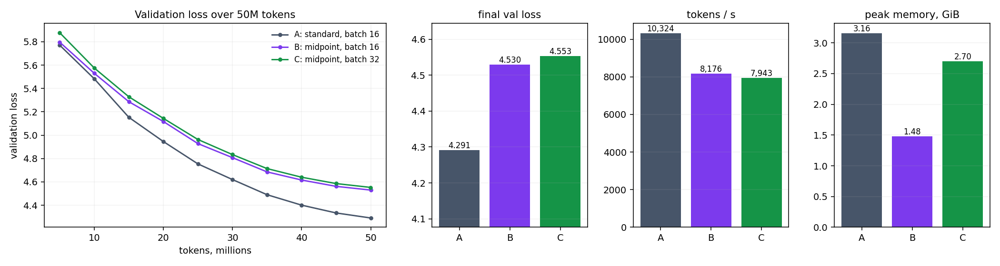
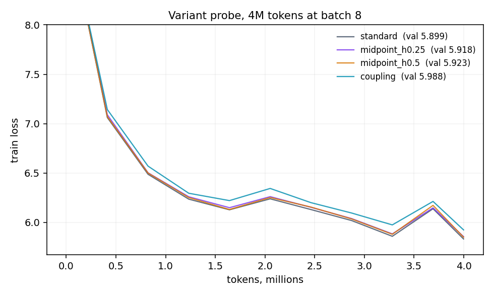
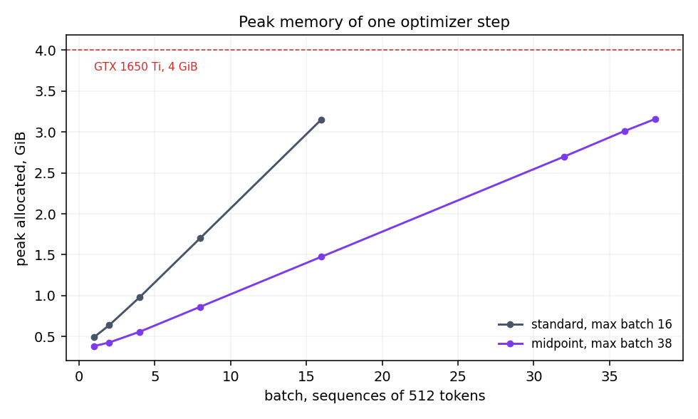

# Session 13 — Distributed Training II, Model and Pipeline Parallel

The assignment is Section 18 of the lesson: train a ~20M LLM for 50M tokens at a fixed batch, then train
it again reversibly at the same batch, then train it reversibly at the largest batch that fits. Report
final loss, tokens/s and peak memory.

**Model:** a 10-layer GPT, 6 heads, `d_model` 384, context 512, vocab 8,192, tied embeddings, no dropout,
no biases. It has **21.05M parameters** (17.70M without embeddings). The blocks are nanoGPT's (reused from
Session 10). Only the way they are chained changes between arms.
**Data:** WikiText-103 (raw), with an 8,192-token byte-level BPE trained on its train split. The run uses
the first **50,000,513 train tokens, read exactly once**. Validation is the first 204,800 of the 281,275
validation tokens.
**Hardware:** one NVIDIA GeForce GTX 1650 Ti, 4 GiB, fp32, torch 2.9.1+cu128. fp16 autocast was measured
and ran *slower* (2.9k tok/s against 11.1k), because this chip has no tensor cores.
**Optimizer:** AdamW (0.9, 0.95), weight decay 0.1, clip 1.0, peak lr 6e-4, 2% warmup, cosine down to 10%.

```bash
cd assignment
python assignment.py selfcheck   # reversible gradients == autograd, float64, CPU
python assignment.py all         # data, probe, maxbatch, runs A, B, C -> results.json (~5.5 h here)
python assignment.py train B     # one run
python plots.py                  # probe.png, maxbatch.png, runs.png
```

---

## The three runs



| run | stack | batch (seq × 512) | steps | peak lr | final val loss | final train loss | tokens/s | peak memory |
|---|---|---|---|---|---|---|---|---|
| **A** | standard | 16 | 6,103 | 6.0e-4 | **4.291** | 4.432 | **10,324** | 3.16 GiB |
| **B** | midpoint reversible, h = 0.25 | 16 | 6,103 | 6.0e-4 | 4.530 | 4.654 | 8,176 | **1.48 GiB** |
| **C** | midpoint reversible, h = 0.25 | 32 | 3,051 | 8.5e-4 | 4.553 | 4.648 | 7,943 | 2.70 GiB |

Each run saw the same 50M tokens in the same order. Train loss is the mean of the last five logged steps.
Validation loss is taken at every 5M tokens (the curve on the left).

- **Memory, A → B:** the reversible run uses **53% less** peak memory at the same batch.
- **Speed, A → B:** it is **21% slower** per token, which is **26% more time**. The lesson estimates 30–50%.
  The extra time is the second forward pass of every block during the backward pass.
- **Loss, A → B:** the reversible stack ends **0.24 nats worse**. The gap is not a fixed early deficit:
  it starts at 0.03 at 5M tokens and widens to 0.24 by 50M. This is the same model with the same data,
  optimizer and schedule. The only change is `p[l+1] = p[l−1] + 2h·f(p[l])` in place of `p = p + f(p)`.
- **B → C:** doubling the batch halves the steps. With lr scaled by √2, C ends only 0.023 behind B,
  so on loss the larger batch costs almost nothing. **On speed it buys nothing either:** 7,943 tok/s
  against 8,176, because at batch 16 the GPU is already saturated. The paper's 2× throughput came from
  a model small enough (hidden 512) that batch 52 left its GPU idle. Ours doesn't.

## Which reversible variant worked



Four arms ran for 4M tokens at batch 8 before the long runs. The reversible arm with the lowest
validation loss went into B and C.

| arm | rule | val loss at 4M | tokens/s | peak memory | reconstruction error (fp32, relative) |
|---|---|---|---|---|---|
| standard | `p ← p + f(p)` (explicit Euler) | 5.899 | 10,225 | 1.70 GiB | — not invertible |
| **midpoint, h = 0.25** | `p[l+1] = p[l−1] + 2h·f(p[l])` | **5.918** | 7,793 | 0.86 GiB | **8.0e-7** |
| midpoint, h = 0.5 | same, `2h = 1` | 5.923 | 7,753 | 0.86 GiB | 1.2e-6 |
| coupling (RevNet/Reformer) | `y1 = x1 + A(x2)`, `y2 = x2 + M(y1)` | 5.988 | 7,618 | 0.78 GiB | 1.4e-3 |

**Midpoint worked.** h = 0.25 (the Lightning LM value) and h = 0.5 differ by 0.005, which is inside
noise. Both trained stably, and the midpoint rule never diverged in any run. The lesson calls it "only
marginally stable", and at this depth and learning rate that margin was enough.

**Coupling also trains, but loses on both counts.** It is 0.07 behind midpoint at 4M tokens. Walking
it back down reconstructs the input about **1,700 times less exactly** (1.4e-3 against 8.0e-7). The likely
cause is that in the coupling form both streams start as the same embedding and each is rebuilt by
subtracting a full-size block output, so fp32 cancellation compounds over ten blocks. The midpoint rule
subtracts a half-scaled update (`2h·f`, with 2h = 0.5), which loses less. This explanation is untested.

**Euler, the standard residual, is not a reversible variant.** Recovering `p[l−1]` from
`p[l] = p[l−1] + f(p[l−1])` needs `f` evaluated at the unknown itself (Section 16). That is run A.

Both reversible stacks are real, not simulated. Each runs inside one `torch.autograd.Function` that
saves only the final two states. During backward it rebuilds every block's input from the two states
it holds, recomputes that block under autograd, and moves one layer down. `python assignment.py
selfcheck` checks this against ordinary autograd on the same maths, in float64:

```
midpoint  max |grad(reversible) - grad(autograd)| = 2.08e-17
coupling  max |grad(reversible) - grad(autograd)| = 1.73e-17
```

After the 50M-token runs, B and C still reconstruct their input to **1.25e-6 and 1.38e-6** relative in
fp32. Training does not make the stack harder to invert.

The midpoint rule needs two states to start, so layer 0 is an ordinary Euler step,
`p[1] = p[0] + h·f₀(p[0])`, whose activations are stored. The other nine layers are rebuilt.

## The largest batch, and why it is only 2.4× larger



| stack | max batch | peak at max | memory per extra sequence |
|---|---|---|---|
| standard | **16** | 3.15 GiB | 0.181 GiB |
| midpoint | **38** | 3.16 GiB | 0.076 GiB |

Run C used 32, the largest power of two below 38, and A and B used 16. The paper reports about 10×
(26 → 257 on an 80 GB H100), and we get 2.4×. The per-sequence cost explains the difference. The output
head alone, `ln_f → Linear(384, 8192) → cross-entropy`, measured on its own, costs **0.0625 GiB per
sequence**. That is four fp32 copies of a 512 × 8,192 logit tensor (logits, softmax, their gradient and
the head's working set), and reversibility cannot touch any of it:

| per sequence of 512 tokens | standard | midpoint | ratio |
|---|---|---|---|
| output head + loss | 0.0625 GiB | 0.0625 GiB | 1× |
| the ten-block trunk | **0.119 GiB** | **0.014 GiB** | **8.5×** |
| total | 0.181 GiB | 0.076 GiB | 2.4× |

The **trunk** saving is 8.5×, which is the paper's ~10×. It probably falls short because one Euler layer
and the embeddings are still stored, and because the stack has 10 layers, not 96. Once the trunk shrinks, the
head is **82% of what every extra sequence costs**, so the head now sets the batch. This is Section 17's
point at small scale: reversibility moves the binding term somewhere else. The lesson's 30.2B model moves
it to the weights and optimizer state. Our 21M model with an 8,192-word vocabulary moves it to the
logits. Computing the loss in chunks of the sequence would remove most of that and push the batch
further. That is the next knob, and it was not turned here.

**Reserved vs allocated.** The peaks above are `max_memory_allocated`. The card has 4 GiB, and
the standard stack still failed at 17 (a predicted 3.33 GiB). The caching allocator's reserve and the
desktop's own use of the GPU take the rest.

## What went wrong along the way

- **The first max-batch search under-reported.** The in-process binary search failed every trial after
  the first out-of-memory error, so it reported 16 and 32. The first OOM probably left memory held
  across trials. Each trial now runs in a fresh subprocess, and the re-run gives 16 and **38**. The
  training runs were not affected, because the power of two below either figure is the same 32.
- **The larger batch was not faster.** I expected C to beat B on tokens/s. It didn't, and it was 3%
  slower. On this GPU, batch 16 already saturates the arithmetic.

## Reproducing

`assignment/results.json` holds everything above: the probe, the max-batch tables, and each run's
logged loss, gradient norm, validation curve, timing, memory and reconstruction error. The token files,
tokenizer and training log are rebuilt under `assignment/data/` (gitignored) by `python assignment.py
data`. The WikiText-103 download is ~500 MB.
